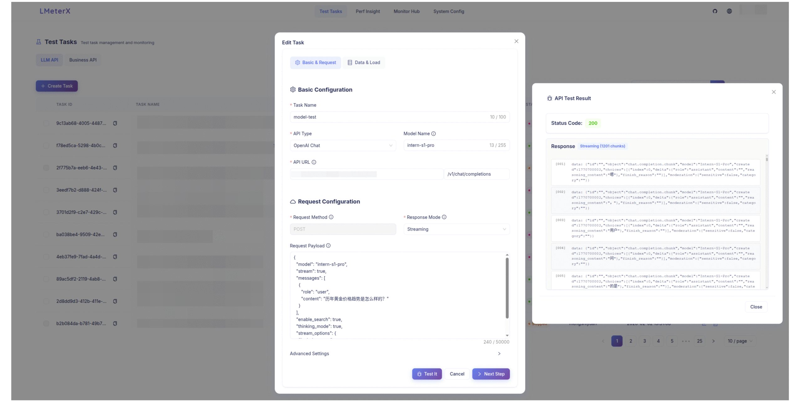

<div align="center">
  
  <p>
    <a href="https://github.com/MigoXLab/LMeterX/blob/main/LICENSE"></a>
    <a href="https://github.com/MigoXLab/LMeterX/stargazers"></a>
    <a href="https://github.com/MigoXLab/LMeterX/network/members"></a>
    <a href="https://github.com/MigoXLab/LMeterX/issues"></a>
    <a href="https://deepwiki.com/MigoXLab/LMeterX"></a>
  </p>
  <p>
    <a href="README_CN.md">简体中文</a> |
    <strong>English</strong>
  </p>
</div>

## 📋 Project Overview

LMeterX is a professional performance testing platform for LLM inference services, general HTTP APIs, and Agent protocols. It covers inference stacks such as LiteLLM, vLLM, TensorRT-LLM, and LMDeploy, cloud services such as Azure OpenAI, AWS Bedrock, and Google Vertex AI, plus A2A Agent collaboration and MCP tool-call workloads. Through an intuitive Web interface, users can create and manage test tasks, monitor testing in real time, and get detailed performance reports for deployment and optimization.

<div align="center">
  
</div>

## ✨ Core Features

- **Broad Framework Compatibility**: Supports mainstream inference frameworks (vLLM, LiteLLM, TRT-LLM) and cloud platforms, ensuring seamless environment migration.
- **Full Modality & Scenarios**: Supports GPT, Claude, Llama to document parsing models like [MinerU](https://github.com/opendatalab/MinerU) and [dots.ocr](https://github.com/rednote-hilab/dots.ocr), covering text, multimodal, and streaming.
- **Multi-Protocol Model APIs**: Native support for OpenAI `/v1/chat/completions`, `/v1/responses`&nbsp;, Anthropic `/v1/messages`, Embeddings, custom model APIs, and general HTTP services.
- **Multi-mode & High-Concurrency Load**: Supports fixed/stepped concurrency&nbsp; strategies, supports simulating ultra-high concurrency, and accurately locates performance inflection points and system capacity limits.
- **System Dataset Library**: Upload once and reuse across LLM, HTTP, A2A, and MCP tasks. A bundled ShareGPT text set is mounted as a public system dataset.
- **Automated Warm-up Mechanism** &nbsp;: Supports automatic model service warm-up to eliminate cold-start effects, ensuring the accuracy of test data.
- **Multi-dimensional Indicator Visualization**: Integrates core indicators such as TTFT, RPS, TPS, and throughput distribution, supporting real-time tracking and visualization of performance data.
- **Engine Resource Monitoring** &nbsp;: Supports real-time monitoring of the load testing machine's CPU, memory, and network bandwidth, accurately identifying local resource bottlenecks.
- **AI-Driven Data Insights**: AI-powered analysis reports &nbsp; with multi-model comparison, intuitively identifying optimization directions.
- **One-stop Web Console**: Manage task scheduling, monitoring, and real-time logs through an intuitive interface, reducing operational complexity.
- **Web parsing & Intelligent load testing**&nbsp;: Enter a web page URL to automatically crawl the page and discover core business APIs, complete connectivity pre-checks, and create load test tasks with zero configuration.
- **AI Agent Integration**&nbsp;: Built-in MCP Server and [OpenClaw](https://github.com/openclaw) Skills with native support for AI agents such as Claude Code and Cursor — automatically generate load test configurations and launch tasks via natural language instructions.
- **A2A & MCP Protocol Load Testing**&nbsp;: Load-test Agent-to-Agent (A2A 1.0) services and MCP Streamable HTTP tool servers. Mix weighted scenarios, choose sync / SSE / async-poll, and get latency, success-rate, and tool-call metrics.
- **Cross-Cluster Engine Scheduling**&nbsp;: Manage local and Kubernetes load-generation clusters from one control plane, route tasks by environment, and monitor or scale Engines centrally.
- **Enterprise-Grade Security & Scaling**: Supports distributed deployment, LDAP/AD, and separate service tokens for Engines and AI agents.

### Feature Comparison
| Dimension            | LMeterX                                                                 | EvalScope                                                                 | llmperf                                                  |
|----------------------|-------------------------------------------------------------------------|---------------------------------------------------------------------------|----------------------------------------------------------|
| Usage                | Web UI for full-lifecycle task creation, monitoring & stop (load-test) | CLI for ModelScope ecosystem (eval & load-test)                          | CLI, Ray-based (load-test)                              |
| Concurrency & Stress | Multi-process / multi-task, fix/stepped load, enterprise-scale load testing               | Command-line concurrency (`--parallel`, `--rate`)                        | Command-line concurrency                                 |
| Test Report          | Multi-model / multi-version comparison, AI analysis, visual dashboard   | Basic report + visual charts (requires gradio, plotly, etc.)             | Simple report                                            |
| Model & Data Support | OpenAI Chat/Responses, Claude, A2A, MCP, custom data & model interfaces   | OpenAI-compatible by default; extending APIs needs custom code           | OpenAI-compatible                                        |
| Performance & Resource Monitoring | Real-time performance metrics and load-generator resource status | - | - |
| Deployment & Scaling | Docker / K8s ready, easy horizontal scaling                             | `pip` install or source code                                             | Source code only                                         |

## 🏗️ System Architecture

LMeterX separates its control plane from its execution plane:

- **Control plane**: Frontend, Backend, MySQL, and VictoriaMetrics manage tasks, scheduling, results, and monitoring.
- **Execution plane**: One or more Engines register with the Backend API, send heartbeats, and claim tasks for their cluster.
- **Cluster Agent (optional)**: Runs in a remote Kubernetes cluster and reconciles the Engine replica count with the control plane.

The diagram below shows the default single-cluster deployment. See the [Multi-Cluster Engine Guide](docs/MULTI_CLUSTER_GUIDE.md) for the distributed topology.

<div align="center">
  
</div>

## 🚀 Quick Start

### Environment Checklist
- Docker 20.10.0+ with the daemon running
- Docker Compose 2.0.0+ (`docker compose` plugin or standalone `docker-compose`)
- At least 4GB free memory and 5GB disk space

> **Need more deployment options?** See the [Complete Deployment Guide](docs/DEPLOYMENT_GUIDE.md) for Kubernetes, air-gapped installs, and advanced tuning.

> Docker Compose creates a default `local` environment. To attach multiple Engine clusters, see the [Multi-Cluster Engine Guide](docs/MULTI_CLUSTER_GUIDE.md).

### One-Click Deployment (Recommended)

```bash
# Download and run the one-click deployment script
curl -fsSL https://raw.githubusercontent.com/MigoXLab/LMeterX/main/quick-start.sh | bash
```

After the script finishes:
- Check container health: `docker compose ps`
- Tail logs if needed: `docker compose logs -f`
- Scale services (if needed): `docker compose up -d --scale backend=2 --scale engine=2`
- Open the web UI at http://localhost:8080 (see [Usage Guide](#usage-guide))

### Data & Volume Layout
- `./data` → mounted to `/app/data` in the `engine` service (bundled ShareGPT source and local image files for multimodal tests; large datasets are **not** baked into the image)
- `./logs` → shared log output for backend and engine
- `./upload_files` → dataset-library files, task uploads, and exported reports

Dataset files are UTF-8 JSONL (one JSON object per line). Choose a type that matches the task: `llm`, `business` (HTTP), `a2a`, or `mcp`. See the [Dataset Usage Guide](docs/DATASET_GUIDE.md) for row formats, field rules, and image mounts.

### Usage Guide

The Tasks page has four tabs: **HTTP API**, **LLM Load Test**, **A2A Agent Collaboration**, and **MCP Tool Calls**. Switch to the tab that matches what you are testing.

#### LLM API Load Testing

1. **Access Web Interface**: Open http://localhost:8080
2. **Create Test Task**: Navigate to Test Tasks → Create Task, configure API request information, test data, and request/response field mappings.
   - 2.1 Environment: Select the Engine cluster that should run the task; use `Local` for a single-node deployment.
   - 2.2 Basic Information: For OpenAI and Claude APIs, select the API type and enter the path, model, and response mode. You may also provide a complete payload.
   - 2.3 OpenAI Responses: Select `OpenAI Responses`, set the path to `/v1/responses`, and use `input` instead of `messages` in the payload.
   - 2.4 Data & Load: Pick a library dataset, upload `.jsonl`, paste JSONL, or skip the dataset and use the request payload as-is. Then set concurrency and duration.
     - OpenAI / Claude Chat: each row needs `prompt` or `messages`; optional `system_prompt` replaces the system message / Claude `system` field. `messages` replaces the whole conversation; otherwise `prompt` replaces the user message.
     - OpenAI Responses: each row uses `prompt`, `input`, or `messages` (written to `input`).
     - Custom Chat / Embeddings: each row is a **full request body**.
   - 2.5 Field Mapping: Only non-standard APIs such as custom APIs require prompt, content, reasoning, and usage paths.
   > 💡 **Tip**: Row formats, ShareGPT compatibility, and local image mounts are documented in the [Dataset Guide](docs/DATASET_GUIDE.md).
3. **API Testing**: In Test Tasks → Create Task, click the "Test" button in the Basic Information panel to quickly test API connectivity (use a lightweight prompt for faster feedback).
4. **Real-time Monitoring**: Navigate to Test Tasks → Logs/Monitoring Center to view full-chain test logs and troubleshoot exceptions
5. **Result Analysis**: Navigate to Test Tasks → Results to view detailed performance results and export reports
6. **Result Comparison**: Navigate to Pref Insight to select multiple models or versions for multi-dimensional performance comparison
7. **AI Analysis**: In Test Tasks → Results or Pref Insight, support intelligent performance evaluation for single or multiple tasks

#### General API Load Testing

1. **Access Web Interface**: Open http://localhost:8080, switch to the "General API" tab
2. **Create Test Task**: Navigate to Test Tasks → Create Task
   - Paste your complete curl command and click "One-Click Parse" to automatically parse request method, URL, headers, and request body
   - Verify that the parsed request information is complete and accurate
3. **API Testing**: Click the "Test" button to verify API connectivity and ensure request information is correct before load testing
4. **Dataset** (Optional): Select a `business` dataset from the library or upload JSONL. Each line must be a complete request-body JSON object; rows are used round-robin. Without a dataset, the form body is sent on every request.
5. **Start Load Testing**: Configure concurrent users, test duration, and other parameters, then click "Create" to start the load testing task
6. **Real-time Monitoring**: During testing, click the "Logs" button to view load testing status and real-time logs
7. **Result Analysis**: After testing completes, click the "Results" button to view load testing results, including RPS, response time, success rate, and other metrics
8. **Copy Template**: To test the same API again, click "..." → "Copy Template" in the actions column. Note that the dataset needs to be re-uploaded after copying, and it's recommended to repeat steps 3-7
9. **Performance Comparison**: To compare performance across different versions or concurrency levels, navigate to the "Performance Comparison" page

#### A2A Agent Collaboration

Use this tab to stress-test Agent-to-Agent (A2A 1.0) services that accept JSON-RPC messages and return task results.

1. Open http://localhost:8080 and switch to **A2A Agent Collaboration**
2. Create a task and fill in the A2A JSON-RPC URL (Agent Card URL is optional; it can be auto-discovered)
3. Click **Test Connection** to confirm the service is reachable
4. Add one or more message scenarios and set weights — traffic is sampled by weight
5. Choose how results are collected: **Sync**, **Streaming SSE**, or **Async submit + poll**
6. Optionally pick an `a2a` library dataset or upload `.jsonl` so the same scenario can send different messages. Each row needs `id`, `scenario_id` (must match a configured scenario), and `message` (`role` = `ROLE_USER`, non-empty `parts`). Extra fields are rejected; weights stay on the scenario, not the row. The file must cover every configured scenario.
7. Set concurrency and duration, then create the task; check logs and results for end-to-end latency and success rate

#### MCP Tool Calls

Use this tab to stress-test MCP Streamable HTTP servers by calling tools concurrently.

1. Switch to **MCP Tool Calls**
2. Fill in the MCP Streamable HTTP URL and click **Test Connection** to discover available tools
3. Add tool-call scenarios: pick a tool name, fill in `arguments`, and set a weight
4. Optionally pick an `mcp` library dataset or upload `.jsonl` to vary arguments for the same tool. Each row needs `id`, `scenario_id` (must match a configured scenario), and `arguments` (object, `{}` allowed). Extra fields are rejected; the file must cover every configured scenario.
5. Set concurrency and duration, then create the task; review tool-call latency and success rate in results

## 🔧 Configuration

### Database Configuration

```bash
# ================= Database Configuration =================
DB_HOST=mysql           # Database host (container name or IP)
DB_PORT=3306            # Database port
DB_USER=lmeterx         # Database username
DB_PASSWORD=lmeterx_password  # Database password (use secrets management in production)
DB_NAME=lmeterx         # Database name
```

### LDAP/AD Authentication Configuration

```bash
# ================= LDAP Authentication Configuration =================
# Enable or disable LDAP authentication (on/off)
LDAP_ENABLED=on

# LDAP server connection
LDAP_SERVER=ldap://ldap.example.com    # LDAP server address
LDAP_PORT=389                          # LDAP server port (389 for LDAP, 636 for LDAPS)
LDAP_USE_SSL=false                     # Use SSL/TLS connection (true for LDAPS)
LDAP_TIMEOUT=5                         # Connection timeout in seconds

# LDAP search configuration
LDAP_SEARCH_BASE=dc=example,dc=com     # Base DN for user search
LDAP_SEARCH_FILTER=(sAMAccountName={username})  # LDAP search filter

# Authentication method 1: Direct bind with DN template (recommended for simple setups)
LDAP_USER_DN_TEMPLATE=cn={username},ou=users,dc=example,dc=com

# Authentication method 2: Bind with service account (recommended for Active Directory)
LDAP_BIND_DN=cn=service,ou=users,dc=example,dc=com    # Service account DN
LDAP_BIND_PASSWORD=service_password                   # Service account password

# JWT configuration (optional)
JWT_SECRET_KEY=your-secret-key-here    # JWT signing key (change in production)
JWT_EXPIRE_MINUTES=10080                 # Token expiration time in minutes (default: 7 days)
```

**Configuration Notes:**
- **Simple LDAP Setup**: Use `LDAP_USER_DN_TEMPLATE` for direct user binding
- **Active Directory**: Use `LDAP_BIND_DN` + `LDAP_BIND_PASSWORD` for service account binding
- **Security**: Always use `LDAP_USE_SSL=true` in production environments
- **Frontend**: Set `VITE_LDAP_ENABLED=on` to enable login UI

### AI Agent Service Token Configuration

`LMETERX_AUTH_TOKEN` is a static service token designed for AI Agent / Skill programmatic access (e.g., Claude Code, Cursor, OpenClaw Skills). It allows agent tools to call designated APIs without going through the interactive LDAP login flow. For detailed configuration and whitelist APIs, please see:[Contributing Guide](docs/CONTRIBUTING.md)

```bash
# ================= Service Token Configuration =================
# Static token for AI Agent / Skill programmatic access.
# When set, the token is bound to the built-in "agent" user.
# Required only when LDAP_ENABLED=on and AI Agent integration is needed.
LMETERX_AUTH_TOKEN=<your-strong-random-token>
```

### Resource Configuration
```bash
# ================= High-Concurrency Load Testing Deployment Requirements =================
# When concurrent users exceed this threshold, the system will automatically enable multi-process mode (requires multi-core CPU support)
MULTIPROCESS_THRESHOLD=1000

# Minimum number of concurrent users each child process should handle (prevents excessive processes and resource waste)
MIN_USERS_PER_PROCESS=500

# ⚠️ IMPORTANT NOTES:
#   - When concurrency ≥ 1000, enabling multi-process mode is strongly recommended for performance.
#   - Multi-process mode requires multi-core CPU resources — ensure your deployment environment meets these requirements.

# ================= Deployment Resource Limits =================
deploy:
  resources:
    limits:
      cpus: '2.0'       # Recommended minimum: 2 CPU cores (4+ cores recommended for high-concurrency scenarios)
      memory: 2G        # Memory limit — adjust based on actual load (minimum recommended: 2G)
```

### VictoriaMetrics Configuration

LMeterX uses [VictoriaMetrics](https://victoriametrics.com/) as a lightweight, high-performance time-series database to store real-time performance metrics and engine resource monitoring data (CPU, memory, network bandwidth).

```bash
# ================= VictoriaMetrics Configuration =================
# VictoriaMetrics service endpoint (used by backend and engine)
VICTORIA_METRICS_URL=http://victoria-metrics:8428

# Engine resource collection interval in seconds (default: 2s)
RESOURCE_COLLECT_INTERVAL=2
```

Key parameters in `docker-compose.yml`:

```yaml
victoria-metrics:
  image: victoriametrics/victoria-metrics:v1.106.1
  ports:
    - "8428:8428"           # HTTP API & UI port
  command:
    - "-retentionPeriod=7d"               # Data retention period (default: 7 days)
    - "-search.maxUniqueTimeseries=50000" # Max unique time series for query
    - "-memory.allowedPercent=60"         # Percentage of available RAM for cache
  deploy:
    resources:
      limits:
        cpus: '1'
        memory: 2G
```

> **Note**: VictoriaMetrics supports cgroup v1 and v2. Every instance in a multi-engine deployment must have a globally unique `engine_id`; container hostnames work automatically, while Kubernetes deployments should set `ENGINE_ID` to the Pod UID.

## 🤝 Development Guide

> We welcome all forms of contributions! Please read our [Contributing Guide](docs/CONTRIBUTING.md) for details.

### Technology Stack

LMeterX adopts a modern technology stack to ensure system reliability and maintainability:

- **Backend Service**: Python + FastAPI + SQLAlchemy + MySQL
- **Load Testing Engine**: Python + Locust + Custom Extensions
- **Frontend Interface**: React + TypeScript + Ant Design + Vite
- **Deployment & Operations**: Docker + Docker Compose + Nginx

### Development Environment Setup

1. **Fork the Project** to your GitHub account
2. **Clone Your Fork**, create a development branch for development
3. **Follow Code Standards**, use clear commit messages (follow conventional commit standards)
4. **Run Code Checks**: Before submitting PR, ensure code checks, formatting, and tests all pass, you can run `make all`
5. **Write Clear Documentation**: Write corresponding documentation for new features or changes
6. **Actively Participate in Review**: Actively respond to feedback during the review process

## 🗺️ Development Roadmap

### Planned
- [ ] CLI command-line tool
- [ ] Multi-interface scenario load testing

## 📚 Documentation

- [Deployment Guide](docs/DEPLOYMENT_GUIDE.md) — deployment and operations
- [Multi-Cluster Engine Guide](docs/MULTI_CLUSTER_GUIDE.md) — cluster registration, Engine setup, scaling, and troubleshooting
- [Dataset Guide](docs/DATASET_GUIDE.md) — JSONL formats for LLM, HTTP, A2A, and MCP tasks
- [Contributing Guide](docs/CONTRIBUTING.md) — development workflow

## 🗂️ Dataset Reference Notes

> The bundled system dataset **ShareGPT V3 Partial** (`ShareGPT_V3_partial.jsonl`) is mounted into the dataset library as a public LLM text set. Each line is `{"id","prompt"}`. It is derived from open-source ShareGPT and follows the original license.

- **Data Source**: [ShareGPT](https://huggingface.co/datasets/learnanything/sharegpt_v3_unfiltered_cleaned_split) dialogue corpus.
- **Adjustment Scope**:
  - Filtered high-quality samples and dropped low-quality or irrelevant turns for load testing.
  - Randomly sampled to keep size manageable while preserving diverse dialogues.

## 👥 Contributing

We welcome any contributions from the community! Please refer to our [Contributing Guide](docs/CONTRIBUTING.md)
Thanks to all developers who have contributed to the LMeterX project!

<a href="https://github.com/MigoXLab/LMeterX/graphs/contributors" target="_blank">
  <table>
    <tr>
      <th colspan="2">
        <br><br><br>
      </th>
    </tr>
  </table>
</a>

## 📝 Citation
If you use EvalScope in your research, please cite our work:

```bibtex
@software{LMeterX2025,
  author  = {LMeterX Team},
  title   = {LMeterX: Enterprise-Grade Performance Benchmarking Platform for Large Language Models},
  year    = {2025},
  url     = {https://github.com/MigoXLab/LMeterX},
}
```

## 📄 Open Source License

This project is licensed under the [Apache 2.0 License](LICENSE).

<div align="center">

**⭐ If you like this project, please click the "Star" button in the upper right corner to support us. Your support is our motivation to move forward!**

</div>
