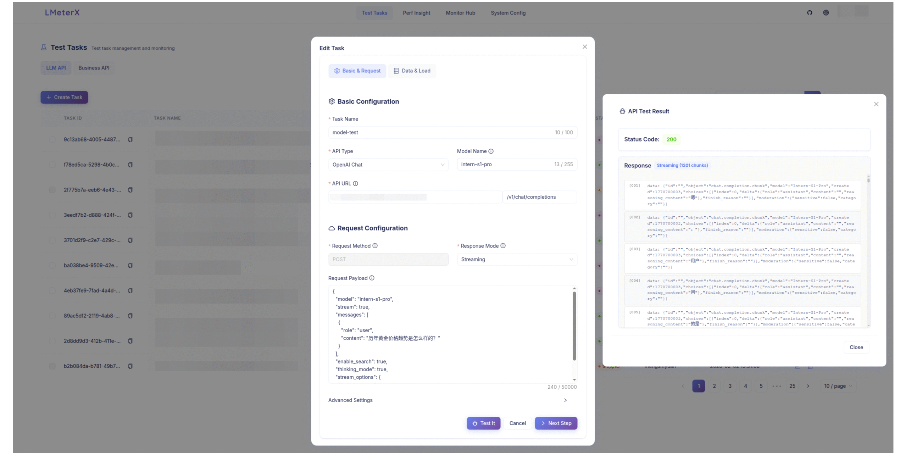

<div align="center">
  
  <p>
    <a href="https://github.com/MigoXLab/LMeterX/blob/main/LICENSE"></a>
    <a href="https://github.com/MigoXLab/LMeterX/stargazers"></a>
  <a href="https://github.com/MigoXLab/LMeterX/network/members"></a>
  <a href="https://github.com/MigoXLab/LMeterX/issues"></a>
    <a href="https://deepwiki.com/MigoXLab/LMeterX"></a>
  </p>
  <p>
    <strong>简体中文</strong> |
    <a href="README.md">English</a>
  </p>
</div>

> ⭐ 如果你喜欢这个项目，请点击右上角的 "Star" 按钮支持我们。你的支持是我们前进的动力！

## 内容导航
- [内容导航](#内容导航)
- [📋 项目简介](#-项目简介)
- [✨ 核心特性](#-核心特性)
  - [工具对比](#工具对比)
- [🏗️ 系统架构](#️-系统架构)
- [🚀 快速开始](#-快速开始)
  - [环境检查清单](#环境检查清单)
  - [一键部署（推荐）](#一键部署推荐)
  - [数据目录与挂载说明](#数据目录与挂载说明)
  - [使用指南](#使用指南)
- [🔧 配置说明](#-配置说明)
  - [数据库配置](#数据库配置)
  - [资源配置](#资源配置)
- [🤝 开发指南](#-开发指南)
  - [技术栈](#技术栈)
  - [开发环境搭建](#开发环境搭建)
- [🗺️ 发展路线图](#️-发展路线图)
  - [开发中](#开发中)
  - [规划中](#规划中)
- [🗂️ 数据集引用说明](#️-数据集引用说明)
- [👥 贡献](#-贡献)
- [📝 引用](#-引用)
- [📄 开源许可](#-开源许可)
- [本项目采用 Apache 2.0 许可证。](#本项目采用-apache-20-许可证)

## 📋 项目简介

LMeterX 是一个专业的大语言模型性能测试平台，支持基于大模型推理框架（如 LiteLLM、vLLM、TensorRT-LLM、LMDeploy 等）的模型推理服务，同时也支持对 Azure OpenAI、AWS Bedrock、Google Vertex AI 等主流云服务进行性能测试。通过直观的 Web 界面，可以轻松创建和管理测试任务，实时监控测试过程，并获得详细的性能分析报告，为模型部署和性能优化提供可靠的数据支撑。


<div align="center">
  
</div>

## ✨ 核心特性

- **通用框架支持** - 兼容主流推理框架（vLLM、LiteLLM、TensorRT-LLM）和云服务（Azure、AWS、Google Cloud）
- **全模型兼容** - 支持 GPT、Claude、Llama 等主流大模型，也支持[MinerU](https://github.com/opendatalab/MinerU)、[dots.ocr](https://github.com/rednote-hilab/dots.ocr)等文档解析大模型
- **高负载压测** - 模拟高并发请求，精准探测模型性能极限
- **多场景覆盖**&nbsp; - 支持流式/非流式、文本/多模态/自定义数据集
- **专业指标统计** - 首Token延迟、吞吐量(RPS、TPS)、成功率等核心性能指标
- **AI智能报告**&nbsp; - 提供 AI 智能分析报告，多维度多模型可视化结果对比
- **Web控制台** - 提供任务创建、停止、状态跟踪、全链路日志监控等一站式管理
- **企业级部署** - Docker容器化，支持弹性扩展与分布式部署

### 工具对比

| 维度 | LMeterX | EvalScope | llmperf |
|------|---------|---------|-----------|
| 使用 | 提供 Web UI：任务创建、监控、停止全生命周期管理（压测） | CLI 命令行，面向 ModelScope 生态（效果评测和压测）| CLI 命令行，依赖 Ray 框架（压测） |
| 并发与压测 | 支持多进程、多任务并发，企业级规模化压测 | 支持命令参数并发 | 支持命令参数并发 |
| 测试报告 | 支持多模型/多版本对比，AI 分析，提供可视化页面 | 基础报告 + 可视化图表（需额外安装 gradio, plotly等） | 简易报告 |
| 模型与数据支持 | 支持 OpenAI 格式，支持自定义数据和模型接口 | 默认支持 OpenAI 格式，扩展新 API 需自行实现代码 | 支持 OpenAI 格式 |
| 部署与扩展 | 提供 Docker / K8s 部署方案，易于弹性伸缩 | `pip` 或源码 | 源码 |

## 🏗️ 系统架构

LMeterX 采用微服务架构，由四个核心组件构成：

- **后端API服务** - FastAPI REST API，负责任务管理和数据存储
- **压测引擎** - Locust负载测试引擎，执行性能测试任务
- **前端界面** - React + TypeScript + Ant Design 现代化Web界面
- **MySQL数据库** - 存储测试任务、结果数据和配置信息

<div align="center">
  
</div>

## 🚀 快速开始

### 环境检查清单
- Docker 20.10.0+（确保 Docker 守护进程已启动）
- Docker Compose 2.0.0+（支持 `docker compose` 或 `docker-compose`）
- 至少 4GB 可用内存、5GB 磁盘空间

> **需要更多部署方式？** 请查阅 [完整部署指南](docs/DEPLOYMENT_GUIDE_CN.md)，获取 Kubernetes、离线环境等高级方案。

### 一键部署（推荐）

```bash
# 默认使用预构建镜像启动全套服务
curl -fsSL https://raw.githubusercontent.com/MigoXLab/LMeterX/main/quick-start.sh | bash
```

启动完成后可执行：
- `docker compose ps` 查看容器状态
- `docker compose logs -f` 追踪实时日志
- `docker compose up -d --scale backend=2 --scale engine=2` 服务扩容(如需)
- 在浏览器打开 http://localhost:8080（详见下方「使用指南」）

### 数据目录与挂载说明
- `./data` → 挂载到 `engine` 容器的 `/app/data`（大规模数据集不会打包进镜像，便于更新）
- `./logs` → 后端与压测引擎的统一日志输出目录
- `./upload_files` → 用户上传的自定义文件及导出的报表

如需准备自定义数据，请参考 [数据集使用指南](docs/DATASET_GUIDE.md)。

### 使用指南

1. **访问界面**: 打开 http://localhost:8080
2. **创建任务**: 导航至 测试任务 → 创建任务，配置 API 请求信息、测试数据以及请求响应字段映射
   - 2.1 基础信息: 对于 OpenAI-like 和 Claude-like API 只需填写 API 路径、模型与响应模式，也可在请求参数中补充完整 payload
   - 2.2 数据&负载: 根据需要选择数据集类型、并发数、压测时间等
   - 2.3 字段映射: 针对自定义 API 需要配置 payload 中 prompt 对应字段路径，以及响应数据中 content、reasoning_content、usage 等字段路径；该映射对于使用压测数据集和解析流式响应尤为关键
   > 💡 **提示**: 若需自定义图文数据集压测，请参考 [数据集使用指南](docs/DATASET_GUIDE.md) 了解数据准备、挂载与常见问题排查。
3. **API 测试**: 在 测试任务 → 创建任务，点击基础信息面板的「测试」按钮，快速验证接口连通性（建议使用简短 prompt）
4. **实时监控**: 访问 测试任务 → 日志/监控中心，查看全链路测试日志，快速定位异常
5. **结果分析**: 进入 测试任务 → 结果，查看详细性能指标并导出报告
6. **结果对比**: 在 模型擂台 模块选择多个模型/版本，进行多维度性能对比
7. **AI 分析**: 在 测试任务 → 结果/模型擂台 中配置 AI 分析服务后，可对单个或多任务进行智能评估

## 🔧 配置说明

### 数据库配置
```bash
=== 数据库配置 ===
DB_HOST=mysql
DB_PORT=3306
DB_USER=lmeterx
DB_PASSWORD=lmeterx_password
DB_NAME=lmeterx
```

### 资源配置
```bash
=== 高并发压测 部署要求 ===
# 当并发用户数超过此阈值，系统将自动启用多进程模式（需多核 CPU 支持）
MULTIPROCESS_THRESHOLD: 1000
# 每个子进程至少承载的并发用户数（避免进程过多导致资源浪费）
MIN_USERS_PER_PROCESS: 500
# ⚠️ 重要提示：
#   - 当并发量 ≥ 1000 时，强烈建议启用多进程以提升性能。
#   - 多进程模式依赖多核 CPU 资源，请确保部署环境满足资源要求
deploy:
  resources:
    limits:
      cpus: '2.0'    # 建议至少分配 2 核 CPU（高并发场景建议 4 核或以上）
      memory: 2G     # 内存限制，可根据实际负载调整（推荐 ≥ 2G）
```

## 🤝 开发指南

> 💡 **欢迎贡献**！查看 [贡献指南](docs/CONTRIBUTING.md) 了解详情

### 技术栈

- **后端** - Python + FastAPI + SQLAlchemy + MySQL
- **压测引擎** - Python + Locust + 自定义扩展
- **前端** - React + TypeScript + Ant Design + Vite
- **部署** - Docker + Docker Compose + Nginx

```
LMeterX/
├── backend/          # 后端服务
├── st_engine/        # 压测引擎
├── frontend/         # 前端服务
├── docs/             # 文档
├── docker-compose.yml
└── README_CN.md      # 中文说明
```

### 开发环境搭建

1. **Fork项目** → 克隆到本地
2. **创建分支** → 进行功能开发
3. **代码检查** → 运行 `make all` 确保质量
4. **提交PR** → 遵循约定式提交规范
5. **文档更新** → 为新功能撰写文档

## 🗺️ 发展路线图

### 开发中
- [ ] 支持客户端资源监控

### 规划中
- [ ] CLI 命令行工具

## 🗂️ 数据集引用说明

> LMeterX 基于开源 ShareGPT 数据集构建测试样本，严格遵循原始许可要求。

- **数据来源**：使用 [ShareGPT 数据集](https://huggingface.co/datasets/learnanything/sharegpt_v3_unfiltered_cleaned_split) 作为原始对话语料
- **调整范围**：
  - 筛选高质量对话样本，剔除低质量或与压测场景无关的数据
  - 进行随机抽样，减轻数据规模的同时保留多样化对话

## 👥 贡献

我们欢迎来自社区的任何贡献！请参考我们的 [贡献指南](docs/CONTRIBUTING.md)。
感谢所有为 LMeterX 做出贡献的开发者!

<a href="https://github.com/MigoXLab/LMeterX/graphs/contributors" target="_blank">
  <table>
    <tr>
      <th colspan="2">
        <br><br><br>
      </th>
    </tr>
  </table>
</a>

## 📝 引用
如果您在研究中使用了 LMeterX，请引用我们的工作：

```bibtex
@software{LMeterX2025,
  author  = {LMeterX Team},
  title   = {LMeterX: Enterprise-Grade Performance Benchmarking Platform for Large Language Models},
  year    = {2025},
  url     = {https://github.com/MigoXLab/LMeterX},
}
```

## 📄 开源许可

本项目采用 [Apache 2.0 许可证](LICENSE)。
---

<div align="center">


**⭐ 如果这个项目对您有帮助，请给我们一个 Star！您的支持是我们持续改进的动力。**

</div>
