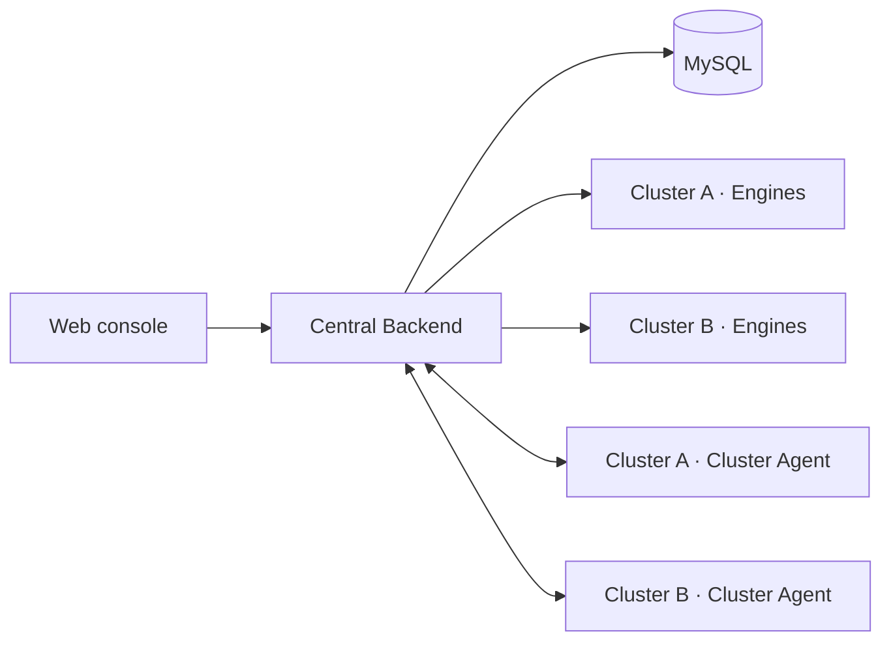

# Multi-Cluster Engine Deployment

One LMeterX Backend can manage multiple load-generation clusters. When a user selects an **Environment**, the Backend dispatches that task only to an available Engine with the same `cluster_id`.



The Cluster Agent only reconciles Kubernetes Engine replicas. It does not execute tasks and is optional when automatic scaling is not required.

## Prerequisites

- Every Engine and Cluster Agent must be able to reach the central Backend. Use HTTPS in production.
- Give each cluster a stable, unique `CLUSTER_ID` and every Engine a globally unique `ENGINE_ID`.
- When upgrading, back up MySQL and apply `mysql/migrations/014_*.sql` through `019_*.sql` in order. Fresh installations already include the schema.
- A remote Engine must be able to reach the system under test. The form's **Test** action also runs in the selected cluster.
- For uploaded datasets, enable OSS on both Backend and Engine. Enable SLS as well if remote live logs must be centralized.

## 1. Configure the central Backend

Engine APIs do not require a token while LDAP is disabled. With LDAP enabled, set a strong token on the Backend:

```bash
LDAP_ENABLED=true
ENGINE_API_TOKEN=<strong-random-token>
```

Use the same `ENGINE_API_TOKEN` on every remote Engine and Cluster Agent. It is accepted only for `/api/engine/*` and `/api/clusters/*`.

Add object storage only when files must cross cluster boundaries:

```bash
OSS_ENABLED=true
OSS_ENDPOINT=<endpoint>
OSS_BUCKET=<bucket>
OSS_ACCESS_KEY=<access-key>
OSS_SECRET_KEY=<secret-key>
```

## 2. Register a cluster

Create the cluster before deploying its Engines. Omit the authentication header when LDAP is disabled. With LDAP enabled, use a signed-in user's JWT. `ENGINE_API_TOKEN` is limited to Engine and existing-cluster control endpoints, so it cannot create a cluster.

```bash
curl -X POST https://<backend>/api/clusters \
  -H 'Content-Type: application/json' \
  -H 'Authorization: Bearer <USER_JWT>' \
  -d '{
    "id": "gpu-prod",
    "name": "GPU Production",
    "description": "Production load generators",
    "min_replicas": 1,
    "max_replicas": 10
  }'
```

The cluster `id` must exactly match the `CLUSTER_ID` used by its Engines and Cluster Agent.

## 3. Deploy Engines

Engines use API mode against the central Backend and do not need a direct central MySQL connection:

```yaml
env:
  - name: ENGINE_MODE
    value: api
  - name: BACKEND_URL
    value: https://<backend>
  - name: CLUSTER_ID
    value: gpu-prod
  - name: ENGINE_API_TOKEN
    valueFrom:
      secretKeyRef:
        name: lmeterx-engine
        key: api-token
  - name: ENGINE_ID
    valueFrom:
      fieldRef:
        fieldPath: metadata.uid
  - name: ENGINE_POD_NAME
    valueFrom:
      fieldRef:
        fieldPath: metadata.name
  - name: DEPLOYMENT_NAME
    value: lmeterx-engine
```

Do not assign a fixed `ENGINE_ID` to a multi-replica Deployment, because replicas would overwrite each other. Each Engine runs one task at a time by default; add replicas to run more tasks concurrently in a cluster.

When OSS or SLS is enabled, configure the same service endpoints and credentials on the Engine. Store credentials in Kubernetes Secrets, not images or ConfigMaps.

## 4. Deploy the Cluster Agent (optional)

Build an image from `cluster-agent/Dockerfile`, then run one replica in the target cluster:

```yaml
env:
  - name: BACKEND_URL
    value: https://<backend>
  - name: CLUSTER_ID
    value: gpu-prod
  - name: ENGINE_API_TOKEN
    valueFrom:
      secretKeyRef:
        name: lmeterx-engine
        key: api-token
  - name: NAMESPACE
    value: lmeterx
  - name: DEPLOYMENT_NAME
    value: lmeterx-engine
  - name: POLL_INTERVAL
    value: "15"
```

The Cluster Agent ServiceAccount needs at least `get` on the target Deployment and `get`, `patch` on `deployments/scale`. Each agent should manage only its own `CLUSTER_ID` and Deployment.

To change the replica count:

```bash
curl -X PUT https://<backend>/api/clusters/gpu-prod/scale \
  -H 'Content-Type: application/json' \
  -H 'X-Authorization: Bearer <ENGINE_API_TOKEN>' \
  -d '{"desired_replicas": 3}'
```

The Backend clamps the value to the cluster's `min_replicas` and `max_replicas`. Without a Cluster Agent, this endpoint updates desired state only and does not change the Kubernetes Deployment.

## 5. Verify and use the cluster

```bash
# List clusters, online Engines, and available slots
curl https://<backend>/api/clusters

# Engine health, from inside the cluster or through a Service
curl http://<engine>:5002/health
```

An Engine registers automatically and sends a heartbeat every 10 seconds by default. It is considered offline after 60 seconds without a heartbeat. Once `online_engines` and `available_slots` are greater than zero, select the environment when creating an LLM, general HTTP, or web-parsing task. Results retain the actual `cluster_id` and `engine_id`.

## Troubleshooting

- **Cluster is missing from the form**: call `POST /api/clusters` and inspect the `/api/clusters` response.
- **Environment shows zero schedulable tasks**: check the Engine's `BACKEND_URL`, `CLUSTER_ID`, token, and heartbeat logs. A busy Engine has no available slot by default.
- **Task remains queued**: the task and Engine must have the same `cluster_id`, with at least one online, idle Engine.
- **Remote dataset is missing**: use shared OSS or place the same file at the same path on every Engine.
- **Scaling has no effect**: verify the Cluster Agent's `NAMESPACE`, `DEPLOYMENT_NAME`, and RBAC permissions.
- **Remote logs are unavailable**: local files are not shared across clusters; configure SLS or use OSS log snapshots as a fallback.
