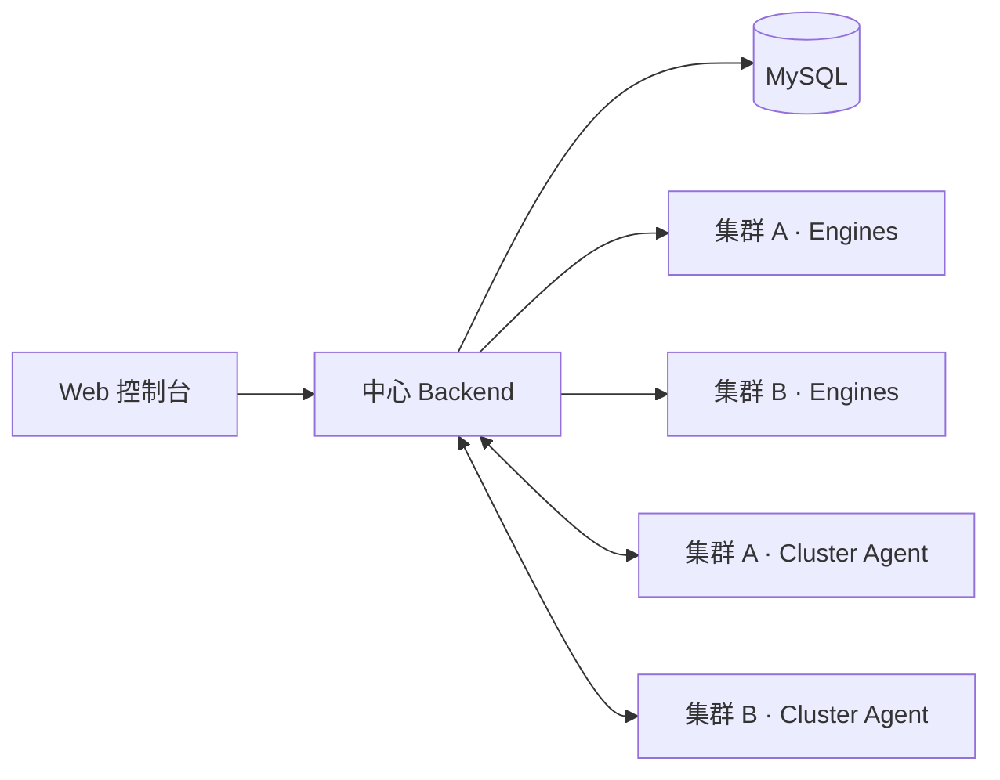

# 跨多集群 Engine 部署指南

LMeterX 可以用一个 Backend 管理多个压测集群。任务创建时选择「压测环境」，Backend 只会把任务分发给同一 `cluster_id` 下的可用 Engine。



Cluster Agent 只负责 Kubernetes Engine 副本数对齐，不参与任务执行；不需要自动扩缩容时可以不部署。

## 部署前准备

- 中心 Backend 必须可被所有 Engine 和 Cluster Agent 访问，生产环境建议使用 HTTPS。
- 每个集群使用唯一且稳定的 `CLUSTER_ID`，每个 Engine 使用全局唯一的 `ENGINE_ID`。
- 从旧版本升级时，先备份数据库，再按顺序应用 `mysql/migrations/014_*.sql` 至 `019_*.sql`。新安装已包含这些表。
- 远端 Engine 必须能够访问被测服务。页面中的「测试」也会在所选集群执行。
- 若使用上传数据集，跨集群部署建议在 Backend 与 Engine 同时启用 OSS；集中查看远端实时日志时可同时启用 SLS。

## 1. 配置中心 Backend

LDAP 关闭时，Engine API 默认无需令牌。LDAP 开启时，在 Backend 设置一个强随机令牌：

```bash
LDAP_ENABLED=true
ENGINE_API_TOKEN=<strong-random-token>
```

所有远端 Engine 与 Cluster Agent 必须使用相同的 `ENGINE_API_TOKEN`。该令牌只能访问 `/api/engine/*` 和 `/api/clusters/*`。

上传文件需要跨集群传输时，再配置：

```bash
OSS_ENABLED=true
OSS_ENDPOINT=<endpoint>
OSS_BUCKET=<bucket>
OSS_ACCESS_KEY=<access-key>
OSS_SECRET_KEY=<secret-key>
```

## 2. 注册压测集群

先在 Backend 创建集群。LDAP 关闭时可省略认证头；LDAP 开启时，创建集群使用已登录用户的 JWT。`ENGINE_API_TOKEN` 仅用于 Engine 与已注册集群的控制接口，不能创建集群。

```bash
curl -X POST https://<backend>/api/clusters \
  -H 'Content-Type: application/json' \
  -H 'Authorization: Bearer <USER_JWT>' \
  -d '{
    "id": "gpu-prod",
    "name": "GPU Production",
    "description": "Production load generators",
    "min_replicas": 1,
    "max_replicas": 10
  }'
```

`id` 必须与后续 Engine 和 Cluster Agent 的 `CLUSTER_ID` 完全一致。

## 3. 部署 Engine

每个 Engine 使用 API 模式连接中心 Backend，不再直接连接中心 MySQL：

```yaml
env:
  - name: ENGINE_MODE
    value: api
  - name: BACKEND_URL
    value: https://<backend>
  - name: CLUSTER_ID
    value: gpu-prod
  - name: ENGINE_API_TOKEN
    valueFrom:
      secretKeyRef:
        name: lmeterx-engine
        key: api-token
  - name: ENGINE_ID
    valueFrom:
      fieldRef:
        fieldPath: metadata.uid
  - name: ENGINE_POD_NAME
    valueFrom:
      fieldRef:
        fieldPath: metadata.name
  - name: DEPLOYMENT_NAME
    value: lmeterx-engine
```

不要为多副本 Deployment 设置固定 `ENGINE_ID`，否则实例会相互覆盖。默认每个 Engine 同时运行一个任务；同一集群增加 Engine 副本即可并行执行更多任务。

如启用 OSS 或 SLS，请在 Engine 设置与 Backend 相同的服务地址和凭据。凭据应放入 Kubernetes Secret，不要写入镜像或 ConfigMap。

## 4. 部署 Cluster Agent（可选）

使用 `cluster-agent/Dockerfile` 构建镜像，并在目标集群部署一个副本：

```yaml
env:
  - name: BACKEND_URL
    value: https://<backend>
  - name: CLUSTER_ID
    value: gpu-prod
  - name: ENGINE_API_TOKEN
    valueFrom:
      secretKeyRef:
        name: lmeterx-engine
        key: api-token
  - name: NAMESPACE
    value: lmeterx
  - name: DEPLOYMENT_NAME
    value: lmeterx-engine
  - name: POLL_INTERVAL
    value: "15"
```

Cluster Agent 的 ServiceAccount 至少需要目标 Deployment 的 `get` 权限，以及 `deployments/scale` 的 `get`、`patch` 权限。每个集群只管理自己的 `CLUSTER_ID` 和 Deployment。

调整副本数：

```bash
curl -X PUT https://<backend>/api/clusters/gpu-prod/scale \
  -H 'Content-Type: application/json' \
  -H 'X-Authorization: Bearer <ENGINE_API_TOKEN>' \
  -d '{"desired_replicas": 3}'
```

Backend 会把数值限制在集群的 `min_replicas` 与 `max_replicas` 之间。未部署 Cluster Agent 时，该接口只更新期望值，不会修改 Kubernetes Deployment。

## 5. 验证与使用

```bash
# 查看集群、在线 Engine 数和可调度槽位
curl https://<backend>/api/clusters

# 查看 Engine 健康状态（在 Engine 容器内或通过 Service）
curl http://<engine>:5002/health
```

Engine 启动后会自动注册，默认每 10 秒发送心跳；超过 60 秒没有心跳会被视为离线。返回的 `online_engines` 和 `available_slots` 大于 0 后，即可在创建 LLM、通用 HTTP 或网页解析任务时选择该压测环境。任务结果会记录实际执行的 `cluster_id` 与 `engine_id`。

## 常见问题

- **集群不出现在页面**：确认已调用 `POST /api/clusters`，并检查 `/api/clusters` 返回值。
- **集群显示 0 个可调度任务**：检查 Engine 的 `BACKEND_URL`、`CLUSTER_ID`、令牌和心跳日志；运行中的 Engine 默认没有空闲槽位。
- **任务一直排队**：确认任务与 Engine 的 `cluster_id` 一致，且至少有一个 Engine 在线并空闲。
- **远端数据集找不到**：共享数据使用 OSS，或确保相同文件存在于每个 Engine 的相同路径。
- **扩缩容没有生效**：确认 Cluster Agent 的 `NAMESPACE`、`DEPLOYMENT_NAME` 和 RBAC 权限正确。
- **远端日志不可见**：本地文件不会自动跨集群共享；配置 SLS，或启用 OSS 日志快照作为回退。
